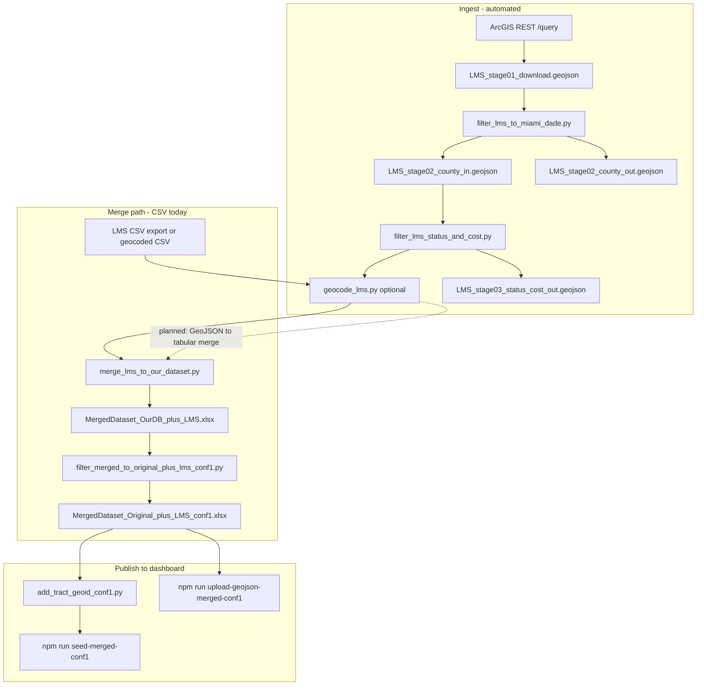

# LMS data pipeline methodology

This document describes how we bring in project data from Miami-Dade County’s **LMS (Local Mitigation Strategy) Project List**, how we quality-check locations, and how that data is intended to merge with the SCALE-R project database and the dashboard.

It is the living reference for this workflow. Update it when scripts, paths, or merge rules change.

---

## Goals

1. **Refresh LMS data on a schedule** (or on demand) without using ArcGIS Online export/extract (not available for this hosted *view* layer).
2. **Keep only Miami-Dade County projects** with trustworthy coordinates for mapping and analysis.
3. **Merge** LMS projects with our existing project inventory without duplicating rows we already track.
4. **Publish** the merged dataset to Supabase and the map app (GeoJSON in Storage).

---

## Authoritative source

| Item | Value |
|------|--------|
| Service | `LMSProjectList_New_View` |
| Layer URL | `https://services.arcgis.com/8Pc9XBTAsYuxx9Ny/ArcGIS/rest/services/LMSProjectList_New_View/FeatureServer/0` |
| Access | Public REST **query** endpoint (no AGOL UI export) |
| Geometry | Point features (WGS84, lon/lat) |
| Stable ID | `ObjectID` (and `GlobalID` in attributes) |

The layer is a **view**. Pagination and GeoJSON must be done via `/query`, not through the ArcGIS Online download UI.

---

## Output naming convention

All pipeline GeoJSON files live in `data/input/lms_project_list/`. Names use a **stage prefix** so they sort in processing order. Suffix **`_in`** = passed the stage; **`_out`** = excluded at that stage (audit).

| Stage | Filename | Meaning |
|-------|----------|---------|
| 1 | `LMS_stage01_download.geojson` | Full ArcGIS download |
| 2 | `LMS_stage02_county_in.geojson` | Inside Miami-Dade (tract polygons) |
| 2 | `LMS_stage02_county_out.geojson` | Outside county or invalid geometry |
| 3 | `LMS_stage03_status_cost_in.geojson` | Passed status whitelist + cost &gt; 0 (**primary ingest artifact**) |
| 3 | `LMS_stage03_status_cost_out.geojson` | Failed status or cost rules |
| — | `LMS_county_cost_excl_stage03_in.geojson` / `.csv` | Supplemental: county + cost&gt;0, excluding stage03 in (no status filter) |

Canonical paths are defined in [`scripts/python/lms_pipeline_paths.py`](../scripts/python/lms_pipeline_paths.py).

---

## Pipeline overview



**Implemented today:** ingest (download + county filter + status/cost filter).  
**Existing production merge:** still driven by **CSV + geocoding** (`geocode_lms.py` → `merge_lms_to_our_dataset.py`).  
**Next integration step:** connect `LMS_stage03_status_cost_in.geojson` into the merge step so refreshes do not depend on manual CSV exports.

---

## Stage 1 — Download from ArcGIS REST

**Script:** [`scripts/python/download_lms_project_list.py`](../scripts/python/download_lms_project_list.py)

**Method:**

1. Call `GET …/FeatureServer/0/query` with:
   - `where=1=1`
   - `outFields=*`
   - `returnGeometry=true`
   - `f=geojson`
   - `orderByFields=ObjectID ASC`
   - `resultOffset` / `resultRecordCount` (default **1000** per page)
2. First request uses `returnCountOnly=true` to read the **total record count** (views often omit or mis-set `exceededTransferLimit`; count-driven paging is required).
3. Page until all features are downloaded; merge pages into one `FeatureCollection`.
4. Retry failed requests with exponential backoff (network resilience).

**Output:**

- `data/input/lms_project_list/LMS_stage01_download.geojson` — full download (all features returned by the service)

**Run:**

```bash
python3 scripts/python/download_lms_project_list.py
# optional: --keep-pages  --page-size 2000
```

**Dependencies:** `requests` (see [`scripts/python/requirements.txt`](../scripts/python/requirements.txt)).

---

## Stage 2 — Filter to Miami-Dade County

**Script:** [`scripts/python/filter_lms_to_miami_dade.py`](../scripts/python/filter_lms_to_miami_dade.py)

**Method:**

1. Load Miami-Dade **census tract** polygons from [`public/censuscommunityresilience.geojson`](../public/censuscommunityresilience.geojson) via `TractIndex` in [`scripts/python/add_tract_geoid_conf1.py`](../scripts/python/add_tract_geoid_conf1.py) (handles ESRI `rings` geometry; covers incorporated and unincorporated county land).
2. For each point feature, test `TractIndex.lookup(lat, lon)`.
3. Split into two GeoJSON files:
   - **In-county** — point falls inside a tract polygon (no extra property).
   - **Out-of-county** — no tract match; add `filter_reason`:
     - `outside_miami_dade_county` — valid point, outside county
     - `invalid_geometry` — missing or non-Point geometry

**Outputs:**

| File | Purpose |
|------|---------|
| `data/input/lms_project_list/LMS_stage02_county_in.geojson` | Input to stage 3 |
| `data/input/lms_project_list/LMS_stage02_county_out.geojson` | Audit bad geocodes (wrong state, swapped lat/lon, etc.) |

**Run:**

```bash
python3 scripts/python/filter_lms_to_miami_dade.py
# or: npm run filter-lms-miami-dade
```

**Typical split (example run):** ~1,520 in-county / ~105 out-of-county of ~1,625 downloaded (counts change when LMS is updated).

**Note:** We do **not** auto-correct swapped latitude/longitude in this step. That can be a follow-up to recover some excluded rows.

---

## Stage 3 — Filter by Status and EstimatedCosts

**Script:** [`scripts/python/filter_lms_status_and_cost.py`](../scripts/python/filter_lms_status_and_cost.py)

**Input:** `LMS_stage02_county_in.geojson` (output of Stage 2).

**Keep** a project only when **both** conditions hold:

1. **Status** is exactly one of:
   - `25% complete`
   - `50% complete`
   - `75% complete`
   - `Project Complete`
   - `Funding Secured`
   - `Construction/Project Begun`
2. **EstimatedCosts** parses to a number **greater than 0** (strips `$` and commas; blank or invalid → 0).

**Outputs:**

| File | Purpose |
|------|---------|
| `data/input/lms_project_list/LMS_stage03_status_cost_in.geojson` | Projects passing status + cost (use for merge / mapping) |
| `data/input/lms_project_list/LMS_stage03_status_cost_out.geojson` | Excluded rows with `filter_reason`: `status_not_allowed` or `cost_not_positive` |

**Run:**

```bash
python3 scripts/python/filter_lms_status_and_cost.py
# or: npm run filter-lms-status-cost
```

**Typical split (example run on current data):** ~177 passed / ~1,343 excluded of ~1,520 in-county (counts change when LMS is updated). Many “Project Complete” rows have zero or blank cost and are excluded by the cost rule.

### Supplemental export — county + cost>0, excluding stage03 in

Use this when you need **in-county LMS projects with positive cost that are not in the 177-project primary ingest** (typically because they failed the status whitelist, not because cost was missing).

**Script:** [`scripts/python/export_lms_county_cost_excl_stage03.py`](../scripts/python/export_lms_county_cost_excl_stage03.py)

**Logic:** Start from `LMS_stage02_county_in.geojson` → keep `EstimatedCosts > 0` → drop any `GlobalID` present in `LMS_stage03_status_cost_in.geojson`.

**Outputs:**

| File | Purpose |
|------|---------|
| `data/input/lms_project_list/LMS_county_cost_excl_stage03_in.geojson` | Map-ready GeoJSON (~498 rows on current snapshot) |
| `data/input/lms_project_list/LMS_county_cost_excl_stage03_in.csv` | Same rows, all LMS columns + Longitude/Latitude (column order matches `LMS_stage02_county_in.csv`) |

**Run:**

```bash
python3 scripts/python/export_lms_county_cost_excl_stage03.py
# or: npm run export-lms-county-cost-excl-stage03
```

**Typical split (current snapshot):** 1,520 in-county → 675 with cost > 0 → **498** after excluding the 177 stage03-in GlobalIDs. These 498 match the `status_not_allowed` rows in `LMS_stage03_status_cost_out.geojson` that still have cost > 0.

---

## Stage 4 — Merge with our project database

Our internal inventory lives in **`data/input/OurDataset on 12-18-2025.csv`** (and derived Excel/Supabase tables). LMS rows must be aligned to our schema and deduplicated.

### Current path (CSV-based)

This is what the repo used before the ArcGIS downloader existed.

| Step | Script | What it does |
|------|--------|----------------|
| Geocode LMS addresses | [`scripts/python/geocode_lms.py`](../scripts/python/geocode_lms.py) | Google Geocoding API on unique addresses → `data/output/logs/geocoding/LMS_Dataset_Geocoded.csv` + `geocoding_log.csv` |
| Merge | [`scripts/python/merge_lms_to_our_dataset.py`](../scripts/python/merge_lms_to_our_dataset.py) | Fuzzy match LMS ↔ our DB; append new LMS-only projects |
| High-confidence filter | [`scripts/python/filter_merged_to_original_plus_lms_conf1.py`](../scripts/python/filter_merged_to_original_plus_lms_conf1.py) | Keep all **our** rows + LMS rows with `GeocodeConfidence == 1.0` |

**Merge matching rules** (`merge_lms_to_our_dataset.py`):

- Compare project **title** (token-sort similarity ≥ 0.85) and **city** (≥ 0.60 when both present).
- Reject matches when **phase numbers** differ (e.g. Phase 1 vs Phase 2).
- Reject matches when **facility/station numbers** in titles are disjoint (e.g. Fire Station #3 vs #14).
- Rows are color-coded in Excel: blue = our DB only, orange = matched pair, green = new from LMS, purple = missing coordinates.

**Outputs:**

- `data/output/merged/MergedDataset_OurDB_plus_LMS.xlsx`
- `data/output/logs/matched/MatchedProjects_LMS_Reference.xlsx`
- `data/output/logs/matched/MatchedProjects_Pairs.xlsx`
- `data/output/merged/MergedDataset_Original_plus_LMS_conf1.xlsx` (filtered)

```bash
python3 scripts/python/geocode_lms.py          # if using CSV LMS input
python3 scripts/python/merge_lms_to_our_dataset.py
python3 scripts/python/filter_merged_to_original_plus_lms_conf1.py
```

### Planned path (ArcGIS GeoJSON → merge)

To support **repeatable LMS refreshes**:

1. Use **`LMS_stage03_status_cost_in.geojson`** as the LMS source (county + status + cost filtered).
2. Map ArcGIS attributes (e.g. `ProjectTitle`, `address`, `city`, `EstimatedCosts`, `Status`, `ProjectType`) to our merge script’s expected columns — either by a small **GeoJSON → CSV** adapter script or by extending `merge_lms_to_our_dataset.py` to accept GeoJSON input.
3. Re-run merge + `conf1` filter + tract enrichment on each refresh.
4. Diff by `ObjectID` / `GlobalID` between downloads to log **new**, **updated**, and **removed** LMS projects (not yet implemented).

Until that adapter exists, the ArcGIS pipeline and the CSV merge pipeline run **in parallel**; the GeoJSON files are the canonical LMS snapshot for new work.

---

## Stage 4b — Enrich new LMS rows (infrastructure type + short description)

After merging LMS projects into our dataset (currently a Claude-assisted merge saved as `data/Merged Using Claude/OurDataset_updated_LMS_NDES_.NINFRAcsv.csv`), the newly added LMS rows arrive with two fields unset:

- `Infrastruc` — empty for all LMS rows (122 in the current file)
- `New_15_25_` — currently a verbatim copy of the long `OLD___Brie` description (needs a 15–25 word summary)

These are filled with local Ollama models, mirroring the existing `*_ollama.py` scripts.

### Infrastructure classification

**Script:** [`scripts/python/classify_infrastructure_lms_csv.py`](../scripts/python/classify_infrastructure_lms_csv.py)

**Method:**

1. Read the Claude-merged CSV; find rows with empty `Infrastruc`.
2. Build few-shot examples (up to 10 per label) from rows already classified in the **same file**.
3. Prompt `qwen2.5:7b` with the type definitions from [`data/input/infrastructure_type_definitions.json`](../data/input/infrastructure_type_definitions.json) + examples + the project title/description.
4. Emit a **short label** — `Blue` | `Green` | `Grey` | `Hybrid` — to match the values already in the dataset (not the long "… Infrastructure" form used by the Excel script).

**Modes:**

- `--test` (default): classify a 30-row sample → review CSV in `data/output/logs/`. No data changes.
- `--full`: classify all empty-`Infrastruc` rows → write a **new** CSV `OurDataset_updated_LMS_INFRA_classified.csv` (original left untouched) + an audit log.

**Run:**

```bash
# Ollama must be running: `ollama serve` and `ollama pull qwen2.5:7b`
python3 scripts/python/classify_infrastructure_lms_csv.py            # test sample
# or: npm run classify-lms-infrastructure
python3 scripts/python/classify_infrastructure_lms_csv.py --full     # write classified CSV
```

**Note:** Ollama requires local GPU (Metal) access and a running server; it cannot run inside a restricted sandbox. Low-confidence predictions are flagged in the summary and audit log for manual review.

### Short description (15–25 words)

**Script:** [`scripts/python/summarize_description_lms_csv.py`](../scripts/python/summarize_description_lms_csv.py)

**Method:**

1. Read the Claude-merged CSV; select **every row whose `New_15_25_` is longer than 25 words** — not just LMS rows. This covers the 86 LMS verbatim copies plus ~52 original rows whose short summary was never trimmed (138 total in the current file). Rows already ≤ 25 words are left unchanged (padding a short description would invent content).
2. Summarize from the **richer of `OLD___Brie` / `New_15_25_`** (whichever has more words), so we always work from the fullest available text.
3. Build few-shot examples (up to 5) from rows that already have a genuine short summary (`New_15_25_` differs from `OLD___Brie`, within 15–25 words).
4. Prompt `qwen2.5:7b` (temperature 0.3) to produce a 15–25 word summary; normalize and cap at 25 words.

**Modes:**

- `--test`: sample rows → review CSV in `data/output/logs/`. No data changes.
- `--full`: summarize all eligible rows → write a **new** CSV `OurDataset_updated_DESC_summarized.csv` (original untouched; in-range rows keep their existing text) + an audit log.

**Run:**

```bash
# Ollama must be running: `ollama serve` and `ollama pull qwen2.5:7b`
python3 scripts/python/summarize_description_lms_csv.py --test
# or: npm run summarize-lms-description -- --test
python3 scripts/python/summarize_description_lms_csv.py --full
```

**Note:** When the source text is terse (e.g. some original rows are only ~26 words), the model may return slightly under 15 words. These are flagged in the run summary and audit log; they are not padded, to avoid inventing content.

---

## Stage 5 — Enrich and publish to the dashboard

After `MergedDataset_Original_plus_LMS_conf1.xlsx` exists:

| Step | Command | Purpose |
|------|---------|---------|
| Census tract GEOID | `npm run add-tract-geoid` | Adds `TRACT_GEOID` via local tract polygons (+ FCC/Census fallbacks) |
| Seed Supabase | `npm run seed-merged-conf1` | Loads merged projects into `projects_merged_conf1` |
| Sync tract column | `npm run sync-tract-geoid` | Updates `tract_geoid` in DB from CSV payload |
| Upload map layer | `npm run upload-geojson-merged-conf1` | Publishes `project-data/projects_merged_conf1.geojson` to Supabase Storage |

See [README — Add census tract GEOID](../README.md#add-census-tract-geoid-projects_merged_conf1tract_geoid) for SQL and details.

---

## Recommended refresh runbook (today)

From the repo root, with Python deps installed (`pip install -r scripts/python/requirements.txt`):

```bash
# 1. Pull latest LMS from ArcGIS
python3 scripts/python/download_lms_project_list.py

# 2. Split in-county vs out-of-county
npm run filter-lms-miami-dade

# 3. Filter by status and estimated cost > 0
npm run filter-lms-status-cost

# 4. (When GeoJSON merge is wired) merge → conf1 filter → tract → seed → upload
#    Until then, continue using the CSV merge scripts if you need an updated Excel/Supabase.
```

Record the download date and feature counts printed by each script for auditability.

---

## File reference

| Path | Role |
|------|------|
| `data/input/lms_project_list/LMS_stage01_download.geojson` | Stage 1 — raw ArcGIS download |
| `data/input/lms_project_list/LMS_stage02_county_in.geojson` | Stage 2 — in county |
| `data/input/lms_project_list/LMS_stage02_county_out.geojson` | Stage 2 — excluded by county |
| `data/input/lms_project_list/LMS_stage03_status_cost_in.geojson` | Stage 3 — passed (primary for merge) |
| `data/input/lms_project_list/LMS_stage03_status_cost_out.geojson` | Stage 3 — excluded by status/cost |
| `scripts/python/lms_pipeline_paths.py` | Canonical path constants for all stages |
| `data/input/LMS Dataset_01-23-2026.csv` | Legacy manual LMS CSV |
| `data/output/logs/geocoding/` | Geocoding logs and geocoded LMS CSV |
| `data/output/merged/` | Merged Excel workbooks |
| `public/censuscommunityresilience.geojson` | Miami-Dade tract boundaries (filter + tract GEOID) |

---

## Design decisions (summary)

| Decision | Rationale |
|----------|-----------|
| REST `/query` instead of AGOL export | View layer has no export UI; query + GeoJSON is supported |
| Count-driven pagination | `exceededTransferLimit` is unreliable on this view with `f=geojson` |
| Tract polygons for county filter | Full county coverage; same geometry used for `TRACT_GEOID` enrichment |
| Two GeoJSON outputs (in / out) | Keeps audit trail of bad coordinates without losing raw download |
| Fuzzy merge on title + city | LMS and our DB names rarely match exactly; rules reduce false duplicates |
| `conf1` filter before publish | Only LMS rows with geocode confidence 1.0 go to the public merged layer (CSV path) |
| Status whitelist + cost &gt; 0 | Focus merge on active/funded projects with non-zero cost (ArcGIS path) |

---

## Future work

- [ ] **GeoJSON → merge adapter** — feed `LMS_stage03_status_cost_in.geojson` into `merge_lms_to_our_dataset.py` (or successor).
- [ ] **Change detection** — compare successive downloads by `ObjectID` / `GlobalID`.
- [ ] **Optional lat/lon swap repair** — recover some of the ~100+ out-of-county points that are likely transposed coordinates.
- [ ] **npm script for download** — e.g. `npm run download-lms` for symmetry with `filter-lms-miami-dade`.
- [ ] **Scheduled refresh** — cron or CI job running download → filter → merge → upload.

---

## Related documentation

- [README — Project structure / data folder](../README.md#project-structure)
- [README — Supabase seed and GeoJSON upload](../README.md#project-data-from-supabase-storage)
- [README — Census tract GEOID](../README.md#add-census-tract-geoid-projects_merged_conf1tract_geoid)
